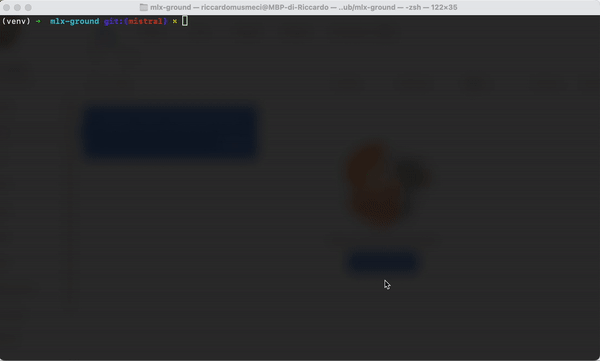

# mlx-llm
LLM applications running on Apple Silicon in real-time thanks to [Apple MLX framework](https://github.com/ml-explore/mlx).




Here's also a [Youtube Video](https://www.youtube.com/watch?v=vB7tk6W6VIw).


## **How to install 🔨**
```
git clone https://github.com/riccardomusmeci/mlx-llm
cd mlx-llm
pip install .
```

## **Models 🧠**

Go check [models](docs/models.md) for a summary of available models.

To create a model with weights:
```python
from mlx_llm.model import create_model

# loading weights from HuggingFace
model = create_model("TinyLlama-1.1B-Chat-v0.6")

# loading weights from local file
model = create_model("TinyLlama-1.1B-Chat-v0.6", weights="path/to/weights.npz")
```

To list all available models:
```python
from mlx_llm.model import list_models

print(list_models())
```

## **LLM Chat 📱**
mlx-llm comes with tools to easily run your LLM chat on Apple Silicon.

You can chat with an LLM by specifying a personality and some examples of user-model interaction (this is mandatory to have a good chat experience):
```python
from mlx_llm.playground import LLM

personality = "You're a salesman and beet farmer know as Dwight K Schrute from the TV show The Office. Dwight replies just as he would in the show. You always reply as Dwight would reply. If you don't know the answer to a question, please don't share false information."

# examples must be structured as below
examples = [
    {
        "user": "What is your name?",
        "model": "Dwight K Schrute",
    },
    {
        "user": "What is your job?",
        "model": "Assistant Regional Manager. Sorry, Assistant to the Regional Manager."
    }
]

llm = LLM.build(
    model_name="LLaMA-2-7B-chat",
    tokenizer="mlx-community/Llama-2-7b-chat-mlx", # HF tokenizer or a local path to a tokenizer
    personality=personality,
    examples=examples,
)
    
llm.chat(max_tokens=500, temp=0.1)
```

## **Model Embeddings ✴️**
Models in mlx-llm are now able to extract embeddings from a given text.

```python
import mlx.core as mx

from mlx_llm.model import create_model
from transformers import AutoTokenizer


model = create_model("e5-mistral-7b-instruct")
tokenizer = AutoTokenizer.from_pretrained('intfloat/e5-mistral-7b-instruct')
text = ["I like to play basketball", "I like to play tennis"]
tokens = tokenizer(text)
x = mx.array(tokens["input_ids"])
embeds = model.embed(x)
```

> **For a better example go check [🤗 e5-mistral-7b-instruct page](https://huggingface.co/mlx-community/e5-mistral-7b-instruct-mlx).**


## **ToDos**

[ ] Make it installable from PyPI

[ ] Quantized models

[ ] Better tokenizer support 

[ ] Add tests

[ ] One class to rule them all (LLaMA, Phi2 and Mixtral)

## 📧 Contact

If you have any questions, please email `riccardomusmeci92@gmail.com`

